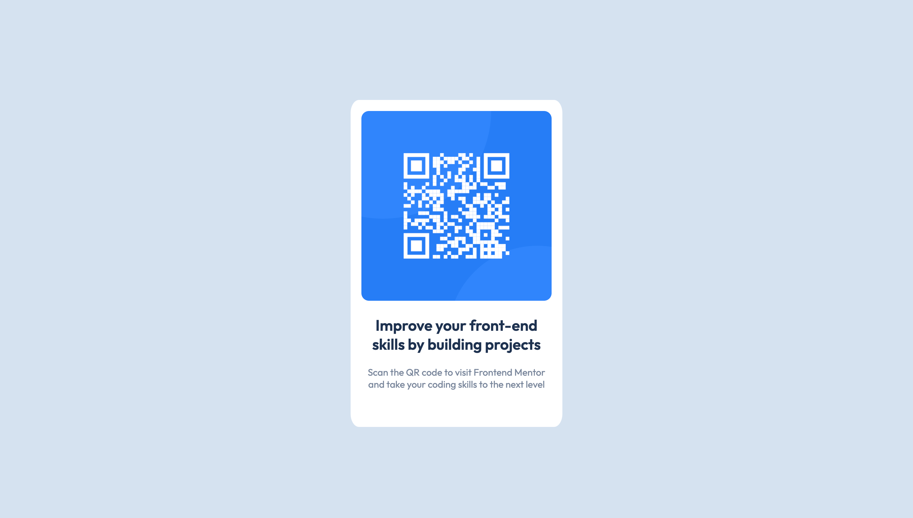

# Frontend Mentor - QR code component solution

This is a solution to the [QR code component challenge on Frontend Mentor](https://www.frontendmentor.io/challenges/qr-code-component-iux_sIO_H). Frontend Mentor challenges help you improve your coding skills by building realistic projects. 

## Table of contents

- [Overview](#overview)
  - [Screenshot](#screenshot)
  - [Links](#links)
- [My process](#my-process)
  - [Built with](#built-with)
  - [What I learned](#what-i-learned)
- [Author](#author)


## Overview

### Screenshot



### Links

- Live Site URL: https://samuelwoniowei.github.io/Qr-code-component/

## My process

### Built with

- Semantic HTML5 markup
- CSS custom properties
- Flexbox


### What I learned

I learned that adding the height property helps with vertically aligning divs.

```css
html, body {
    height: 100%;
}
```
```css
main {
    height: 100%;
    display: flex;
    justify-content: center;
    align-items: center;
}
```


## Author

- Website - https://samuelwoniowei.github.io/Qr-code-component/
- Frontend Mentor - [@SamuelWoniowei](https://www.frontendmentor.io/profile/SamuelWoniowei)
- Twitter - [@_sammyofficial](https://www.twitter.com/_sammyofficial)

